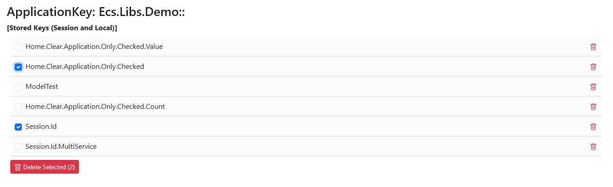
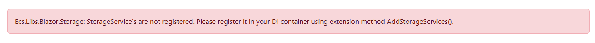

## Using the Ecs.Libs.Blazor.Storage Library

The `Ecs.Libs.Blazor.Storage` library provides a simple and efficient way to manage local and session storage in Blazor applications. This guide will help you get started with using the library in your Blazor projects.

### Installation
To install the `Ecs.Libs.Blazor.Storage` library, you can use the NuGet Package Manager Console or the .NET CLI.
Using the NuGet Package Manager Console:

```bash
Install-Package Ecs.Libs.Blazor.Storage
```
Using the .NET CLI:

```bash
dotnet add package Ecs.Libs.Blazor.Storage
```

### Configuration
After installing the package, you need to configure the storage services in your Blazor application. Open the `Program.cs` file and add the following lines to register the storage services:

```csharp
using Ecs.Libs.Blazor.Storage;
var builder = WebAssemblyHostBuilder.CreateDefault(args);
builder.Services.AddStorageServices();
```

There is also an option to configure the storage services with custom settings:

```csharp
builder.Services.AddStorageServices(options =>
{
	// Customize storage key settings if needed
	options.UseApplicationKeyPrefix = true;
	options.ApplicationKey = "custom-app-identifier-prefix";
	options.PrefixSeparator = '-';
	options.AlwaysStoreAsJson = false;
});
```

### Usage
Once the services are registered, you can inject the storage service into your Blazor components or services. Here’s an example of how to use local storage:

```csharp
@inject IStorageService storageService
@code {
	private async Task SaveDataAsync()
	{
		await storageService.Local.SetItemAsync("key", "value");
	}
	private async Task<string> GetDataAsync()
	{
		return await storageService.Local.GetItemAsync<string>("key", "default value");
	}
	private async Task RemoveDataAsync()
	{
		await storageService.Local.RemoveItemAsync("key");
	}
	private async Task ClearAsync()
	{
		await storageService.Local.ClearAsync();
	}
	private async Task<IEnumerable<string>> GetAllKeysAsync()
	{
		return await storageService.Local.KeysAsync();
	}
}
```

### Session Storage
You can also use session storage:

```csharp
@inject IStorageService storageService
@code {
	private async Task SaveSessionDataAsync()
	{
		await storageService.Session.SetItemAsync("sessionKey", "sessionValue");
	}
	private async Task<string> GetSessionDataAsync()
	{
		return await storageService.Session.GetItemAsync<string>("sessionKey", "default session value");
	}
	private async Task RemoveSessionDataAsync()
	{
		await storageService.Session.RemoveItemAsync("sessionKey");
	}
	private async Task ClearSessionStorageAsync()
	{
		await storageService.Session.ClearAsync();
	}
	private async Task<IEnumerable<string>> GetAllKeysAsync()
	{
		return await storageService.Session.KeysAsync();
	}
}
```

### Manage Storage Items with ApplicationStorage component

The `ApplicationStorage` component allows you to manage storage items declaratively in your Blazor components. Here’s an example of how to use it:
```csharp
@page "/storage"
@using Ecs.Libs.Blazor.Storage

<ApplicationStorage ShowInterface="true" />

@code {

}
```

#### Screensot of component in action


#### Screenshot of component in action if services were not properly registered
